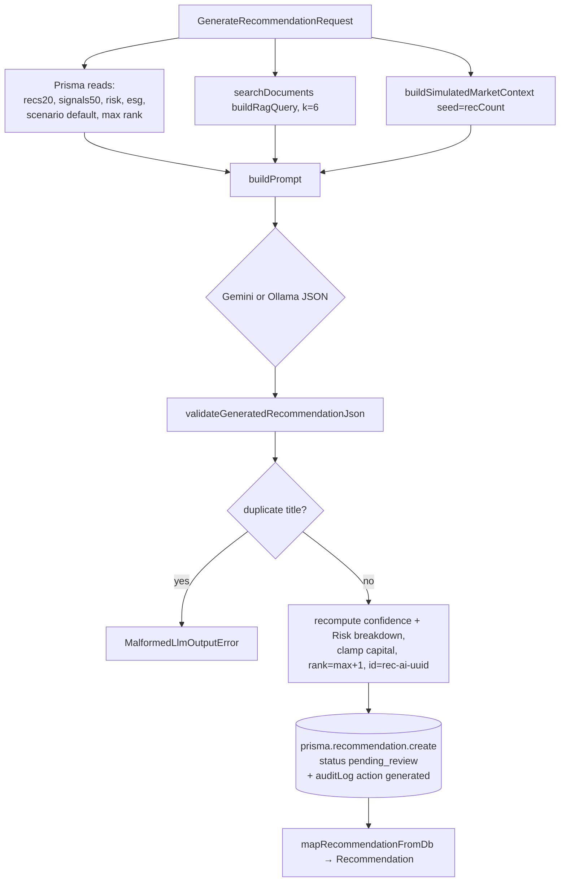

# AI Subsystem Guide

Three AI capabilities share one provider-selection rule and one RAG store:

1. **Recommendation generation** — `POST /api/recommendations/generate` → `lib/recommendations/generateRecommendation.ts`
2. **Assistant chat (streaming)** — `POST /api/ai-assistant`
3. **RAG retrieval** — `lib/rag/*` + `POST /api/rag/ingest`, `GET /api/rag/search`

## Provider selection (uniform everywhere)

> If `process.env.GEMINI_API_KEY` is set → **Gemini**; otherwise → local **Ollama**. Applies to chat, generation, and embeddings.

| Concern | Gemini | Ollama |
|---|---|---|
| Chat/generation model | `GEMINI_MODEL` = `gemini-2.5-flash` | `OLLAMA_MODEL` = `llama3.2` |
| Embedding model | `GEMINI_EMBED_MODEL` = `gemini-embedding-001` (`output_dimensionality: 768`) | `nomic-embed-text` (768) |
| Base URL | `GEMINI_BASE_URL` (v1beta) | `OLLAMA_BASE_URL` = `http://localhost:11434` |

## 1. Gemini integration (`lib/llm/gemini.ts`)

- Exports `GEMINI_MODEL` and `generateJsonWithGemini(prompt): Promise<unknown>`.
- POSTs `:generateContent` with a **45s abort timeout**, `temperature: 0.25`, `maxOutputTokens: 4096`, `responseMimeType: "application/json"`, `thinkingConfig.thinkingBudget: 0`, and a full **`responseSchema`** enforcing the recommendation shape (title, region, sector, country, capitalUsd, irrPct, horizonYears, riskLevel enum, confidence, tags, rationale, scoreBreakdown[{dimension enum×6, score}], riskFactors).
- `extractJsonObject` strips ```json fences, double-parses, falls back to first `{`…last `}`. Throws on non-OK, empty, or `MAX_TOKENS`.

## 2. Ollama integration (`lib/llm/ollama.ts`)

- Exports `OLLAMA_MODEL` and `generateJsonWithOllama(prompt): Promise<unknown>`.
- POSTs `/api/chat` with `stream: false`, `format: "json"`, system + user messages, `options: { temperature: 0.25, num_predict: 1200 }`. Reads `message.content` (or `response`), same `extractJsonObject`.

## 3. Embeddings (`lib/rag/embed.ts`)

- `getEmbedding(text): Promise<number[]>` — Gemini `:embedContent` (`taskType: "RETRIEVAL_QUERY"`, `output_dimensionality: 768`, 20s timeout) or Ollama `/api/embeddings` (12s). `fetchWithTimeout` wraps both.
- `toVectorLiteral(number[]): string` → pgvector literal `[a,b,…]`.

## 4. Vector search (`lib/rag/search.ts`)

- `searchDocuments(query, topK=5): Promise<SearchResult[]>` — embeds the query, runs raw SQL cosine distance:
  ```sql
  SELECT id,title,source,chunk,content,(embedding <=> $1::vector) AS distance
  FROM documents WHERE embedding IS NOT NULL ORDER BY distance ASC LIMIT $2
  ```
  (`$queryRawUnsafe`, parameterized). `SearchResult = { id, title, source, chunk, content, distance }`.
- `formatContextBlock(results)` → `"[Source i: title]\ncontent"` joined by `\n\n---\n\n`.

## 5. RAG pipeline (ingest)

`chunk.ts` `chunkText(text, maxChunkChars=500, overlapChars=80)` — splits on blank lines, accumulates up to max with tail overlap; oversized paragraphs are sentence-split.

`POST /api/rag/ingest`: for each `mock-data/documents/*.md` → chunk → embed → insert; for each DB recommendation → `formatRecommendationChunk` → embed → insert (one chunk). Idempotent unless `?force=true` (which `DELETE`s first). Inserts use parameterized `$1..$5` with `$5::vector`.

**Corpus (`mock-data/documents/`):** banking / oil-gas / solar sector outlooks, ESG policy targets, Kenya investment brief, portfolio risk framework, recommendation history (7 files).

## 6. Recommendation generation (`lib/recommendations/generateRecommendation.ts`)



**Prompt construction (`buildPrompt`)** embeds: the request, excluded titles (dedupe), compact portfolio (top 8), latest signals (12), risk scores, ESG sectors, scenario snapshot, simulated market context, and the RAG block. Rules cap rationale ≤80 words, 3–5 tags, 2–4 risk factors, capital within requested range, horizon 3–8y default.

**Post-processing:**
- `computeConfidence(generated, riskScores, sectorEsgScore)` — starts from the model's confidence, applies a **risk penalty** (matched risk factors' avg vs 50), an **ESG bonus** (sector overall vs 70), and a **risk-level penalty** (high +6, medium +2, low −2 subtracted), clamped 0–100.
- `adjustRiskScoreBreakdown` — sets the "Risk" dimension to `100 − avg(matched risk scores)`.
- `isDuplicateTitle` / `normalizeTitle` — rejects near-duplicate titles (throws `MalformedLlmOutputError`).

**Validation (`lib/recommendations/schema.ts`)** — hand-rolled (no zod). `validateGeneratedRecommendationJson` bounds every field (title ≤140, capital 1–1e10, irr −20..50, horizon 1–15, confidence 0–100, ≥1 tag/risk factor) and fills all 6 score dimensions (missing → 50). `parseGenerateRecommendationRequest` validates the request (risk enum, horizon 1–15, ascending positive capital range).

**Simulated market context (`lib/online/simulatedMarketContext.ts`)** — `buildSimulatedMarketContext(request, seed)` returns `{ noveltyAngle, macroIndicators, sectorMomentum, policySignals, riskNotes, esgNotes }` from a small sector map (solar/banking/agriculture + default) and 6 novelty angles. Purely synthetic (no real market API).

⚠️ **No authorization** guards this DB-writing path (`// TODO: Add auth and role checks`).

## 7. Assistant chat (`app/api/ai-assistant/route.ts`)

- **Input:** `{ context, portfolioSnapshot, messages:{role,text}[], model, persona }`.
- **RAG:** `searchDocuments(context+lastQuestion, 4)` (best-effort; failures logged, chat continues).
- **Context assembly:** page context + a portfolio-snapshot sentence (`getPortfolioSnapshot()` from the store) + RAG block, appended to the last user message.
- **Streaming:** Gemini SSE (`:streamGenerateContent?alt=sse`, temp 0.3, maxOutputTokens 512, `systemInstruction` = persona) → parsed `data:` lines re-emitted as raw text; on Gemini failure falls back to Ollama `/api/chat` streaming (NDJSON `message.content`). Response is `text/plain` with headers `X-AI-Model`, `X-RAG-Used`.
- **Client:** `useAIAssistantDrawerViewModel.ask` reads the stream incrementally via `getReader()` + `TextDecoder`, updating the last assistant message token-by-token.

### Personas (system prompts)
| Key | Role |
|---|---|
| `standard` | General analyst; cite numbers/docs; 3–5 sentences |
| `risk` | Risk specialist; capital preservation, stress metrics |
| `esg` | ESG advocate; taxonomy, GHG, governance |
| `conservative` | Defensive sectors, steady IRR, caution on leverage |

## News ingestion

Populates the live feed with **real market news** from Google News RSS (public, key-free), classified into `Signal` fields by the LLM. Modules live in `lib/ingest/`.

```
watchlist (sector/region/country-tagged queries)
   → googleNews.fetchGoogleNews(query)   RSS fetch + dependency-free parse
   → classify.classifyArticles(batch)    Gemini | Ollama → {type, severity, sentiment}; heuristic fallback
   → newsIngest.runNewsIngest()          dedupe (stable id from link) → prisma.signal.createMany(skipDuplicates)
   → timestamp = now  → /api/signals/stream (SSE) pushes to clients live
```

- **Source:** `lib/ingest/googleNews.ts` hits `news.google.com/rss/search?q=…`; a small regex parser extracts title/link/guid/pubDate/publisher/summary (no XML dependency).
- **Classification:** `lib/ingest/classify.ts` batches all articles into **one** LLM call (Gemini if `GEMINI_API_KEY`, else Ollama) returning `{ results: [{ i, type, severity, sentiment }] }`. Falls back to a deterministic keyword lexicon if no provider or the call fails, so ingestion never breaks. Sector/region/country come from the watchlist, not the LLM (avoids hallucination).
- **Insert:** `lib/ingest/newsIngest.ts` stamps `timestamp = now` (so SSE broadcasts them), `source = "internal"`, id = `news-<hash(link)>` for idempotent re-runs. Tracks `running` + `lastRun` in module state.
- **Triggers:** the 6-hour scheduler (`lib/ingest/scheduler.ts`, started from root `instrumentation.ts` `register()` in the Node runtime) **and** on-demand via `POST /api/signals/ingest` (Live Feed "Fetch latest news" button → `ingestNewsApi`).
- **Runtime mode (`auto`/`manual`/`off`):** held in `lib/ingest/scheduler.ts` on `globalThis` (per server process), initial value from `INGEST_ENABLED`. The scheduler interval always runs but only ingests when mode is `auto`; `POST` is blocked (`409`) when `off`. Toggled from the Live Feed **Auto / On-demand / Off** control via `PATCH /api/signals/ingest` (`setIngestModeApi` / `getIngestStatusApi`).
- **Env:** `INGEST_ENABLED` (`false` → starts in `manual`), `INGEST_INTERVAL_MS` (default 6h, min 60s), `INGEST_LIMIT_PER_QUERY` (default 6), `INGEST_WATCHLIST` (JSON override), `INGEST_TOKEN` (optional endpoint secret), `INGEST_DISABLE_OLLAMA`.
- **Legal note:** Bloomberg/terminal feeds are proprietary and not scraped; swap the source module for a licensed API (Finnhub/Marketaux/Alpha Vantage) by replacing `fetchGoogleNews`.

## Key coupling to preserve

- Embedding dimension **768** is fixed across the column, IVFFlat index, and both embedding models.
- The Gemini `responseSchema` and `validateGeneratedRecommendationJson` must stay in sync with `types/recommendation.ts` (`ScoreDimension`, `RiskLevel`).
- Provider selection logic is duplicated in `gemini.ts`/`ollama.ts` callers (`generateRecommendation`, `embed`, `ai-assistant` route) — keep the `GEMINI_API_KEY` check consistent.
