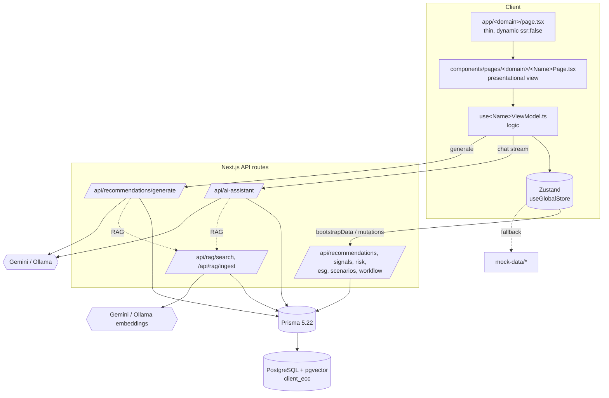

# Architecture Guide

## 1. High-level architecture

The app is a **client-heavy Next.js App Router** dashboard. Route pages are thin server-less shells that lazy-load presentational client components; all data lives in a single Zustand store hydrated from a set of Next.js API routes backed by Prisma/PostgreSQL, with mock-data fallbacks. AI features (assistant chat, recommendation generation, RAG) run in API routes against Gemini or a local Ollama instance and a pgvector document store.



## 2. Layered responsibilities

| Layer | Location | Responsibility | May touch store? | May touch DB/network? |
|---|---|---|---|---|
| Route shell | `app/<d>/page.tsx` | `dynamic(ssr:false)` import of the page view | No | No |
| View | `components/pages/<d>/<Name>Page.tsx` | Presentational only; renders from view-model output | No | No |
| View-model | `components/pages/<d>/use<Name>ViewModel.ts` | Derives state, wires interactions | **Yes** | via mutations/fetch |
| Global store | `lib/store/useGlobalStore.ts` | Single source of truth + async actions | — | fetch to `/api/*` |
| API routes | `app/api/**/route.ts` | HTTP boundary, validation, business logic | — | **Prisma** |
| Data access | `lib/db/prisma.ts`, `lib/mappers/*` | Prisma singleton + row→domain mapping | — | Prisma |
| AI/RAG | `lib/llm/*`, `lib/rag/*`, `lib/recommendations/*`, `lib/online/*` | LLM calls, embeddings, vector search, generation | — | LLM + Prisma |
| Shared | `lib/utils*`, `lib/navigation/*`, `lib/hooks/*`, `types/*` | Cross-cutting helpers, types | some hooks | some hooks |

Drawers (`components/drawers/*`) follow the same view/view-model split as pages.

## 3. Folder structure

```
app/                     App Router routes
  layout.tsx             Root layout: fonts, Providers, Sidebar/Topbar/LiveFeedPanel, drawers
  page.tsx               redirect("/dashboard")
  <domain>/page.tsx      thin dynamic wrapper per domain
  <domain>/loading.tsx   skeleton fallback (only dashboard, recommendations, live-feed)
  api/<domain>/route.ts  REST endpoints
  api/ai-assistant, api/recommendations/generate, api/rag/{search,ingest}
components/
  pages/<domain>/        <Name>Page.tsx + use<Name>ViewModel.ts   (feature views)
  drawers/               RecommendationDrawer, AIAssistantDrawer (+ their VMs)
  layout/                Sidebar, Topbar, LiveFeedPanel, NotificationBell, banners, boot components
  cards/                 KPICard, RecommendationCard, SignalCard, ScenarioCard, RiskFactorRow, ESGCompanyRow
  charts/                Recharts wrappers + chart-gate (many kebab-case files are DEAD)
  skeletons/             loading placeholders
  ui/                    shadcn/Radix primitives + a few app-specific UI pieces
  providers/             Providers (TooltipProvider + DataBootstrap)
lib/
  store/useGlobalStore.ts    the Zustand store
  db/prisma.ts               Prisma singleton
  api/mutations.ts           client fetch wrappers
  hooks/                     useData, useSignalStream, useSignalNavigation, useDebounce, useCrossModuleFilter
  mappers/                   Prisma row -> domain type
  llm/                       gemini.ts, ollama.ts
  rag/                       chunk.ts, embed.ts, search.ts
  recommendations/           schema.ts (validation), generateRecommendation.ts
  online/simulatedMarketContext.ts
  navigation/                signalCrossModule.ts, signalActionMapping.ts
  utils.ts, utils/{formatters,colorHelpers}.ts, dataSource.ts
types/                    Authoritative domain types (+ legacy block in index.ts)
mock-data/                Seed/fallback data (.v2 files hold the real arrays) + documents/*.md (RAG corpus)
prisma/                   schema.prisma, seed.ts, migrations/
config/database.env       DATABASE_URL for CLI/dev
docker-compose.yml        local Postgres + pgvector
```

## 4. Data flow

**Bootstrap (read path).** `Providers` mounts `DataBootstrap`, which calls `useGlobalStore.bootstrapData()` once. That action fetches all six domain endpoints in sequence, stores the results, and records per-domain success in `sourcesFromDb`. Any domain that fails silently keeps its mock-data default. `MockDataSourceBanner` reflects the outcome (offline banner and/or retry error card).

**Reads in the UI.** Pages never fetch directly. A view (`<Name>Page`) calls its view-model, which subscribes to slices of the store and derives display data with `useMemo`.

**Mutations (write path).** Optimistic-update pattern: the store applies the change locally, fires a `fetch` to the relevant API route via `lib/api/mutations.ts`, and reverts on failure. Examples: `updateRecommendationStatus` (PATCH), `saveScenarioAction` (POST), ESG save (PATCH via view-model).

**Cross-module navigation.** The store doubles as an event bus. Clicking a signal (`useNavigateFromSignal`) sets region/sector/risk-factor/workflow-focus fields and routes to the relevant page; "stress test" writes `scenarioInputs` and routes to `/scenarios`; "Ask AI" sets `aiDrawerContext`/`aiDrawerInitialMessage` and opens the assistant drawer.

**Live signals.** `SignalStreamBoot` (in root layout) starts `useSignalStream`, which polls `/api/signals?after=…` every 30s and `addSignal`s new rows; if the API never succeeds it synthesizes signals from local templates.

## 5. Configuration & environment

| Variable | Purpose | Default |
|---|---|---|
| `DATABASE_URL` | Postgres connection | from `config/database.env` (`…@127.0.0.1:5433/client_ecc`) |
| `GEMINI_API_KEY` | Enables Gemini path (chat, generate, embeddings) | unset → Ollama fallback |
| `GEMINI_MODEL` | Chat/generation model | `gemini-2.5-flash` |
| `GEMINI_EMBED_MODEL` | Embedding model | `gemini-embedding-001` (768-dim) |
| `GEMINI_BASE_URL` | Gemini API base | `https://generativelanguage.googleapis.com/v1beta` |
| `OLLAMA_BASE_URL` | Local Ollama base | `http://localhost:11434` |
| `OLLAMA_MODEL` | Local chat/generation model | `llama3.2` |
| `NEXT_ALLOWED_DEV_ORIGINS` | Comma list for `allowedDevOrigins` | `localhost,127.0.0.1,192.168.1.18` |

`next.config.ts` has a `loadDatabaseUrlFallback()` that reads `config/database.env` into `process.env.DATABASE_URL` when unset (so the app can boot without env-cmd). Ollama embedding model is fixed to `nomic-embed-text` (768-dim) to match the pgvector column.

## 6. Development workflow

```bash
npm install              # runs prisma generate (postinstall)
npm run db:up            # docker compose up -d  (Postgres+pgvector on :5433)
npm run db:setup         # migrate deploy + seed  (env-cmd -f config/database.env)
npm run dev              # next dev
# optional AI data:
#   POST /api/rag/ingest        embed mock-data/documents/*.md + DB recommendations
```

Other scripts: `db:migrate` / `db:migrate:dev`, `db:seed`, `db:studio`, `db:generate`, `db:down`, `build`, `start`, `lint`. All DB scripts wrap Prisma with `env-cmd -f config/database.env`.

> **Next.js 16 caveat** (`AGENTS.md`): this is a newer Next.js than most training data. Read `node_modules/next/dist/docs/` before using framework APIs. App Router `params`/`searchParams` are async (see `app/api/recommendations/[id]/route.ts` awaiting `context.params`).

## 7. Coding conventions (observed)

- **MVVM split** is strict: views are presentational; only view-models import `useGlobalStore` / `lib/api`. New pages should follow `page.tsx (dynamic ssr:false) → <Name>Page.tsx → use<Name>ViewModel.ts`.
- **File naming is inconsistent but has a rule of thumb:** live app components are **PascalCase**; most **kebab-case** chart files are dead (exceptions: the `status-badge` / `severity-bar` re-export barrels and `chart-gate`). Prefer PascalCase for new components. See the duplication table in [component-catalog.md](component-catalog.md).
- **Re-export barrels**: `ui/status-badge.tsx` and `ui/severity-bar.tsx` re-export the PascalCase implementation and are the canonical import paths (`@/components/ui/status-badge`).
- **Charts** must be wrapped in `ChartResponsive` from `components/charts/chart-gate.tsx` (defers recharts until the container is measured).
- **Domain types** come from `types/<domain>.ts` via the `@/types` barrel. Do not use the legacy block at the bottom of `types/index.ts`.
- **DB row → domain** always goes through a mapper in `lib/mappers/*` (casts string columns to unions, `Date → ISO string`, `null → undefined`, unwraps `Json`).
- **LLM provider selection**: check `GEMINI_API_KEY`; Gemini if present, else Ollama. Keep this consistent in any new AI code.
- **Client wrappers for relative time** (`TimeAgo`) exist to avoid SSR hydration mismatches — follow that pattern for time-sensitive UI.

## 8. Hidden assumptions & gotchas

- **Status casing mismatch:** `Recommendation.status` is lowercase (`pending_review`, `under_review`, `approved`, `rejected`); `WorkflowStatus` is UPPERCASE (`PENDING_REVIEW`, …, plus `EXECUTED`). `mapStatus()` (workflow VM) bridges them; `RecommendationDrawer` re-implements the same mapping inline (duplication to watch).
- **Embedding dimension is fixed at 768** across the pgvector column, the migration's IVFFlat index (`lists = 10`, `vector_cosine_ops`), Ollama `nomic-embed-text`, and Gemini `output_dimensionality: 768`. Changing the model requires changing all of these together.
- **Seed does not populate `documents`/embeddings.** RAG requires a separate `POST /api/rag/ingest` call.
- **Scenario math lives in the domain layer** at `lib/scenarios/compute.ts` (`computeScenarioCards`, `computeIrrProjection`, `expectedIrr`, `baseFromRecommendation`, `computeSensitivity`, `computeMonteCarloBands`, `DEFAULT_INPUTS`/`DEFAULT_BASE`), reused by both the scenarios view-model and the seed. `mock-data/scenarios.v2.ts` is now a thin re-export barrel kept for the seed's import path. The scenario anchor (base IRR/risk) is seeded from the selected recommendation via `baseFromRecommendation`. Monte Carlo uses a deterministic seeded PRNG (mulberry32 + Box-Muller) so the P10/P50/P90 band is stable across renders for the same inputs.
- **`decisionLog` in the store** is a lightweight client-only audit trail (not a `types/*` export). The durable audit trail is `RecommendationAuditLog` in the DB.
- **`allowedDevOrigins` includes a hard-coded LAN IP** (`192.168.1.18`) as a default — environment-specific.
- **Prisma is pinned to 5.22.0** intentionally to keep the classic `datasource { url = env("DATABASE_URL") }` block (Prisma 7 removed it).
