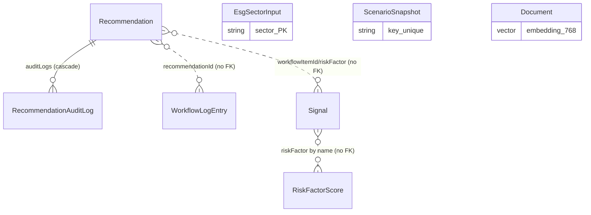

# Database Reference

- **Engine:** PostgreSQL 16 + **pgvector** (`docker-compose.yml`: `pgvector/pgvector:pg16`, port `5433`, db `client_ecc`, user `decisionlayer`).
- **ORM:** Prisma **5.22.0** (pinned for the classic `datasource { url = env("DATABASE_URL") }`).
- **Client:** singleton in `lib/db/prisma.ts` (global-cached; dev logs `query/error/warn`; avoids hot-reload connection exhaustion).
- **Naming:** domain models are camelCase; tables are snake_case via `@@map`. No per-column `@map`.
- **Mapping:** every read passes through `lib/mappers/*` (string→union casts, `Date → ISO string`, `null → undefined`, `Json` unwrap).

## Entity relationships

Only `Recommendation → RecommendationAuditLog` is an enforced FK (ON DELETE CASCADE). All other cross-links are **soft** (by id/name string, no referential integrity).

## Models

### `Recommendation` → `recommendations`
`id String @id`, `rank Int`, `title String`, `region String`, `sector String`, `country String`, `capitalUsd Float`, `irrPct Float`, `horizonYears Int`, `riskLevel String`, `confidence Int`, `status String`, `tags String[]`, `rationale String @db.Text`, `scoreBreakdown Json`, `modelVersion String`, `generatedAt DateTime`, `riskFactors String[]`, `dataSource String @default("mock")`, `createdAt @default(now())`, `updatedAt @updatedAt`. Relation `auditLogs RecommendationAuditLog[]`.
- **Business meaning:** an AI investment recommendation. `status` is lowercase (`pending_review`/`under_review`/`approved`/`rejected`); `riskLevel` low/medium/high; `scoreBreakdown` = 6 `{dimension, score}`; `riskFactors` are names matching `RiskFactorScore.name`.
- **`dataSource`** (also on `Signal`, `RiskFactorScore`, `EsgSectorInput`): `"mock"` for seeded fixtures (the default, so all seed rows inherit it), `"live"` for pipeline-produced rows — set explicitly by `generateRecommendation` (AI recs) and the news ingester (signals). DB-level lifecycle flag per brief §4.2 so mock rows can be replaced without app-layer changes; **not** threaded through the domain types/mappers. Column is camelCase `dataSource` (this schema uses camelCase columns), not the brief's illustrative `data_source`.
- **Lifecycle:** seeded (12) or created by `generateRecommendation` (`id = rec-ai-<uuid>`, status `pending_review`, `rank = maxRank+1`); status changes via `PATCH` (each writes an audit log).

### `RecommendationAuditLog` → `recommendation_audit_logs`
`id @default(cuid())`, `recommendationId`, `action`, `comment String? @db.Text`, `at @default(now())`. FK `recommendation` (ON DELETE CASCADE). Index `@@index([recommendationId])`.
- **Meaning:** durable audit trail. `action` = `"generated"` or a status. Written on generate + every PATCH.

### `Signal` → `signals`
`id @id`, `title`, `body @db.Text`, `type`, `severity`, `sentiment Float`, `reach Int`, `timestamp DateTime`, `source`, `country`, `region`, `sector`, `riskFactor String?`, `workflowItemId String?`, `url String?`, `publisher String?`. Index `@@index([timestamp])`.
- **Meaning:** market/news signal. `type` risk/opportunity/policy/deal/market; `severity` critical/high/medium/low; `source` bloomberg/talkwalker/internal; `sentiment` -1..1. `riskFactor`/`workflowItemId` are soft cross-links used by signal navigation. `url`/`publisher` are set by news ingestion (source article link + outlet).
- **Lifecycle:** seeded (27); created via `POST /api/signals` and the news ingester; queried with `after` cursor for polling and pushed live via SSE.

### `RiskFactorScore` → `risk_factor_scores`
`id @id`, `name`, `score Int`, `previousScore Int`, `sparklineData Float[]`, `source`, `region`.
- **Meaning:** one portfolio risk factor (0–100). `sparklineData` = 7 points; UI derives trend from `score` vs `previousScore`. Seeded (7: Market, Credit, Liquidity, Operational, Regulatory, ESG/Reputation, Geopolitical).

### `EsgSectorInput` → `esg_sector_inputs`
`sector String @id`, `payload Json`.
- **Meaning:** per-sector ESG bundle. `payload` = `{ kpis: EsgSectorKpi[], scores: {E,S,G,overall,grade} }`. Editable via `PATCH /api/esg` (whole payload replaced). Seeded (~8 sectors).

### `ScenarioSnapshot` → `scenario_snapshots`
`id @default(cuid())`, `key String @unique @default("default")`, `defaultInputs Json`, `scenarioCards Json`, `irrProjection Json`, `updatedAt @updatedAt`.
- **Meaning:** a saved scenario sandbox. `key` names it (`"default"` is the seeded baseline). All three payloads are precomputed on the client. Upserted by `POST /api/scenarios`.

### `WorkflowLogEntry` → `workflow_log_entries`
`id @id`, `recommendationId`, `status`, `actor`, `role`, `timestamp DateTime`, `comment String @db.Text`. Index `@@index([recommendationId])`.
- **Meaning:** workflow history event. `status` is **UPPERCASE** `WorkflowStatus` (PENDING_REVIEW/UNDER_REVIEW/APPROVED/REJECTED/EXECUTED) — note the casing differs from `Recommendation.status`. Soft link by `recommendationId`. Seeded (6).

### `Document` → `documents`
`id @default(cuid())`, `title`, `source`, `chunk Int`, `content @db.Text`, `embedding Unsupported("vector(768)")?`, `createdAt @default(now())`.
- **Meaning:** one RAG chunk. `embedding` is a 768-dim pgvector (nomic-embed-text / gemini-embedding-001). Because Prisma can't type vectors, all vector I/O is **raw SQL** (`lib/rag/search.ts`, `api/rag/ingest`).
- **Lifecycle:** **not seeded** — populated by `POST /api/rag/ingest` from `mock-data/documents/*.md` + DB recommendations.

## Migrations

- `20250504120000_init` — creates the 7 core tables, PKs, indexes (`signals_timestamp_idx`, audit/workflow `recommendationId` indexes, unique `scenario_snapshots_key_key`), and the audit-log FK (CASCADE).
- `20250504130000_add_pgvector_documents` — `CREATE EXTENSION IF NOT EXISTS vector`; creates `documents`; **IVFFlat** index on `documents(embedding)` with `vector_cosine_ops`, `lists = 10` (approximate cosine search).
- `20260718061738_add_signal_source_link` — adds nullable `url`/`publisher` to `signals` (news-ingested source links).

## Seed (`prisma/seed.ts`)

Own `PrismaClient`. **Delete order:** audit logs → workflow → signals → risk → esg → scenario → recommendations. **Insert order:** recommendations (12) → signals (27) → risk (7) → esg (~8) → one `ScenarioSnapshot` (`key:"default"`, computed via `computeScenarioCards`/`computeIrrProjection`) → workflow (6). Does **not** touch `documents`/embeddings. Run via `npm run db:seed` (env-cmd + tsx).

## Field caveats to remember

- **`Recommendation.status` (lowercase) ≠ `WorkflowLogEntry.status` (UPPERCASE).** Bridge with `mapStatus()`.
- **Embedding dim (768)** is coupled across column + IVFFlat index + both embedding models — change together.
- **Soft cross-links** (`riskFactor`, `workflowItemId`, `recommendationId` outside audit logs) have no FK; validate existence in app code if needed.
- **Json columns** (`scoreBreakdown`, ESG `payload`, scenario bundles) are cast through `Prisma.InputJsonValue` on write and to domain types on read.
