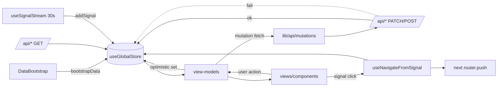

# State Management Guide — `useGlobalStore` (Zustand)

Single client store: `lib/store/useGlobalStore.ts` (`"use client"`, `create<GlobalStore>`). It is **the single source of truth** for all domain data and cross-cutting UI state. Only view-models (and a few store-connected layout components) read/write it. Initial values are the mock-data arrays, replaced on `bootstrapData()`.

## State variables

### Selection / cross-module event-bus
| Field | Type | Meaning |
|---|---|---|
| `selectedRecommendation` | `Recommendation \| null` | Active recommendation (drawer, risk boost) |
| `selectedSignal` | `Signal \| null` | Active signal (live feed) |
| `activeRegionFilter` | `string \| null` | Region filter shared across recs/esg/signals |
| `activeSectorFilter` | `string \| null` | Sector filter shared across recs/esg/signals |
| `activeRiskFactor` | `string \| null` | Highlighted risk factor |
| `workflowFocusRecommendationId` | `string \| null` | Row to auto-scroll on `/workflow` |

### Domain data
| Field | Type | Source |
|---|---|---|
| `recommendations` | `Recommendation[]` | `mockRecommendations` → `/api/recommendations` |
| `signals` | `Signal[]` | `mockSignals` → `/api/signals` (capped 500 on add) |
| `unreadSignalCount` | `number` | count of **critical** signals; `addSignal` increments only when the new signal is `critical`; reset to 0 on read; recomputed on bootstrap |
| `riskFactorScores` | `RiskFactorScore[]` | `mockRiskScores` → `/api/risk` |
| `esgSectors` | `EsgSectorInputs[]` | `mockEsgInputs` → `/api/esg` |
| `workflowLogEntries` | `WorkflowLogEntry[]` | `mockWorkflowLog` → `/api/workflow` |
| `decisionLog` | `{recommendationId, action, comment?, at}[]` | client-only audit trail |
| `scenarioInputs` | `ScenarioInputs` | `DEFAULT_INPUTS` (+ stress-test writes) |
| `savedScenarios` | `{key, defaultInputs, scenarioCards, irrProjection}[]` | `/api/scenarios?all=true` |

### Bootstrap / status
| Field | Type | Meaning |
|---|---|---|
| `bootstrapComplete` | `boolean` | bootstrap finished |
| `sourcesFromDb` | `Record<DataDomain, boolean>` | per-domain: loaded from DB (true) vs mock (false) |
| `lastBootstrapError` | `string \| null` | partial-failure message (null on full outage — treated as normal) |

### AI / drawer UI
| Field | Type | Meaning |
|---|---|---|
| `isAIDrawerOpen` / `isRecommendationDrawerOpen` | `boolean` | drawer visibility |
| `aiDrawerContext` | `string` | page/context prompt for the assistant |
| `aiDrawerInitialMessage` | `string \| null` | auto-sent on drawer open, then cleared |
| `aiModel` | `"ollama" \| "gemini"` | assistant model toggle (default `gemini`) |
| `aiPersona` | `"standard" \| "risk" \| "esg" \| "conservative"` | assistant persona |

## Actions

**Sync setters:** `setSelectedRecommendation` (also sets region/sector/risk-factor and opens drawer), `setSelectedSignal`, `setActiveSectorFilter`, `setActiveRegionFilter`, `setActiveRiskFactor`, `setWorkflowFocusRecommendationId`, `addRecommendation`, `addSignal` (prepend, cap 500, bump unread), `markSignalsRead`, `openAIDrawer`, `closeAIDrawer`, `setAiDrawerInitialMessage`, `setScenarioInputs`, `resetScenarioInputs`, `setAiModel`, `setAiPersona`, `openRecommendationDrawer` (delegates to `setSelectedRecommendation`), `closeRecommendationDrawer`, `mergeEsgSector`.

**Derived selector:** `getPortfolioSnapshot()` → `{recommendations, approved, pending, underReview, rejected, unreadSignals}` (fed to the AI assistant).

**Async / optimistic actions:**
- `updateRecommendationStatus(id, status, comment?)` — optimistic local update + `decisionLog` entry → `updateRecommendationStatusApi` (`PATCH /api/recommendations/:id`) → replace with server row on success, **revert** on failure.
- `saveScenarioAction(name, inputs, cards, projection)` — optimistic upsert into `savedScenarios` → `saveScenarioBundleApi` (`POST /api/scenarios`) → returns success bool.
- `loadSavedScenariosAction()` — `GET /api/scenarios?all=true` → `savedScenarios`.
- `bootstrapData()` — sequential fetch of all six domains; marks `sourcesFromDb`; computes partial-vs-full failure for `lastBootstrapError`.

## Who reads / writes each field

| Field | Writers | Readers |
|---|---|---|
| `recommendations` | `bootstrapData`, `addRecommendation`, `updateRecommendationStatus` | dashboard/recs/workflow VMs, `GlobalSearch` |
| `signals` | `bootstrapData`, `addSignal` | dashboard/live-feed VMs, `LiveFeedPanel` VM, `GlobalSearch`, `useSignalStream` |
| `riskFactorScores` | `bootstrapData` | dashboard/risk VMs |
| `esgSectors` | `bootstrapData`, `mergeEsgSector` | dashboard/esg VMs |
| `workflowLogEntries` | `bootstrapData` | workflow VM, recommendation-drawer VM |
| `activeRegionFilter`/`activeSectorFilter` | recs VM, `setSelectedRecommendation`, signal nav, `GlobalSearch` | recs VM, `useCrossModuleFilter`, esg VM |
| `activeRiskFactor` | `RiskFactorRow`, signal nav, `GlobalSearch`, `setSelectedRecommendation` | risk VM, `useCrossModuleFilter` |
| `workflowFocusRecommendationId` | signal nav, `GlobalSearch` | workflow VM |
| `scenarioInputs` | scenarios VM, stress-test (live-feed VMs) | scenarios VM |
| `savedScenarios` | `saveScenarioAction`, `loadSavedScenariosAction` | scenarios VM |
| `unreadSignalCount` | `addSignal`, `markSignalsRead`, `bootstrapData` | `NotificationBell` VM |
| `aiDrawerInitialMessage` | live-feed VMs, workflow VM (via `openAIDrawer` siblings) | AI drawer VM (auto-send) |
| `aiModel`/`aiPersona` | AI drawer VM | AI drawer VM, `/api/ai-assistant` payload |

## State-flow diagram

## Notes & smells

- **Optimistic + revert** is the norm for writes; keep new mutations consistent.
- **Filter state is split** (region/sector in store; risk/status/confidence local in the recs VM). ESG keeps a local copy of `esgSectors` shadowed via effect.
- **Store as event bus**: cross-module coordination (`activeRegionFilter`, `workflowFocusRecommendationId`, `aiDrawerInitialMessage`, `scenarioInputs`) rather than URL/query params.
- **`decisionLog`** (client) and **`RecommendationAuditLog`** (DB) are parallel audit trails; only the latter is durable.
